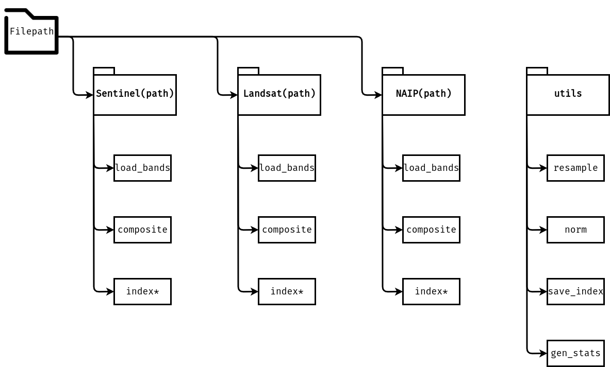
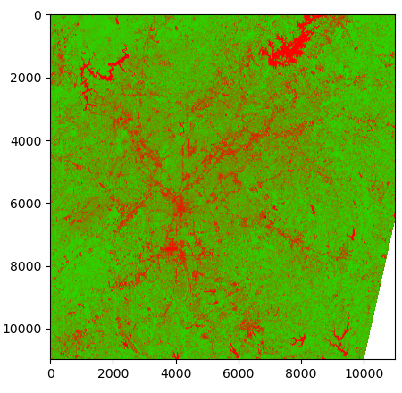

# Summary 
The public availability of multispectral satellite imagery combined with the high temporal frequency with which it is taken allows for imagery to be incorporated into many aspects of research.
The uses of indices from remote sensing products range from tracking vegetation health, monitoring forest canopy, observing water levels, fire detection, and even aiding in the creation of land cover datasets [@Silleos:2006; @Joshi:2006; @Ghulam:2007; @Roy:2006; @Jin:2013].
Indices are computed through the application of algebraic formulas where the inputs are either the spectral bands or other ancillary information from multispectral imagery.
However, outside of raster calculator GUI's, like those in proprietary geospatial software’s such as ArcGIS [@Esri:2020] and ERDAS Imagine [@Erdas:2004], and in the open source QGIS [@QGIS:2019], there is currently no streamlined method for calculating these indices.
Additionally, processing functions are provided such as image compositing and cell size resampling.

The goal of Rindcalc is to provide an efficient and seamless processing library capable of working directly with remote sensing products outside of a GUI or the usage of a complex python pipeline built from scratch.
Spatial information is maintained with the use of the Geospatial Data Abstraction software Library (GDAL) [@GDAL:2020] to convert bands to and from NumPy arrays [@Van:2011]. 
The indices computed with Rindcalc can subsequently be added to other workflows and algorithms to aid in research.

Rindcalc is separated by remote sensing product with functionality for Landsat-8 [@Roy:2014], Sentinel-2 [@Drusch:2012], and National Agricultural Imagery Program (NAIP) [@USDA:2020] provided at the time of writing.
For each remote sensing product a class is initialized which will read the filepaths of each raster band within the image directory utilizing the default naming conventions of each product. 
Each class contains two main dictionary attributes, `paths` and `bands`, both of which follow the same naming convention where the key for each band is titled "band_band#", e.g. band seven of Landsat-8 would be identified with the key "band_7". 
This naming convention is utilized throughout Rindcalc with the goal of simplifying the usage of the individual bands.
Furthermore, the usage of the dictionary structure allows the data to be easily queryable and allows for only specific bands to only be loaded as arrays for reduced memory usage when working with each remote sensing product.
A simple structure of Rindcalc can be viewed in \autoref{fig:rindcalc}.


    

# Key Modules

* **`load_bands`**: 
  For each remote sensing product individual bands can be read as an array using the `load_bands` method.
  The method allows for index formulas to be applied with the imagery in the form of matrix calculations.
  Each index computed with Rindcalc only loads the neccisary bands through the `load_bands` method in order to reduce the memory size needed to compute each index.  
 
- **`composite`**:
  For remote sensing products three band composites of varying band combinations are important to highlight various features.
  Rindcalc provides a simple structure to create said composites as the band specification inputs use the naming convention standard within Rindcalc.

- **`index`**: 
  Index is not the name of this method but rather a placeholder where "index" is replaced by the name of the index to be calculated, e.g. `Landsat(in_path).NDVI()`. 
  The index method is the core of Rindcalc effectively automating the Input/Output (I/O) in the process to compute and calculate indices.
  Indices computed are output as an array to allow for easy integration with other Python libraries such as Matplotlib, Scikit-learn, and Scikit-Image.
  Each index however, also possess to ability to save the output index as a GeoTIFF raster with corresponding spatial information to allow for its use in GIS.
  
#Custom Equations 

Rindcalc is purposefully kept modular and indices not available in Rindcalc can easily be implemented by the end user with Rindcalc acting as the I/O library with only a few lines of code as opposed to the many lines required by GDAL.
An example of using Rindcalc to compute a user equation is as follows:

``` python
from rindcalc import Sentinel
from rindcalc.utils import save_index

# Intialize class and read all band paths into dictionary
data = Sentinel("path_to_img_dir")

bands = data.load_bands(["band_4", "band_8"])

# Normalized Difference Vegetation Index (NDVI) array
ndvi = ((bands["band_8"] - bands["band_4"]) / 
	(bands["band_8"] + bands["band_4"]))

save_index(ndvi, "output.tif", snap=data.path["band_4"])

```



# Citations


